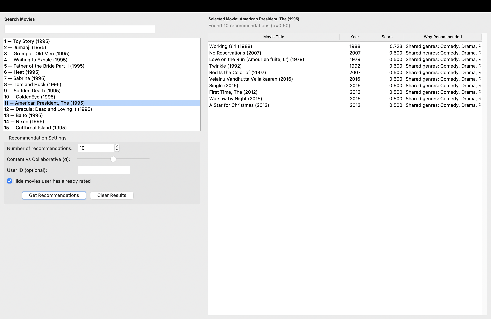

# 🎬 Hybrid Movie Recommender

A sophisticated movie recommendation system that combines **content-based filtering** and **collaborative filtering** to deliver personalized movie suggestions with enhanced accuracy and coverage.

## 📚 Table of Contents

- [🌟 Features](#-features)
- [🚀 Quick Start](#-quick-start)
  - [Prerequisites](#prerequisites)
  - [Installation](#installation)
- [🎯 How It Works](#-how-it-works)
  - [Architecture Overview](#architecture-overview)
  - [Core Components](#core-components)
- [📊 Algorithm Details](#-algorithm-details)
  - [Content-Based Filtering](#content-based-filtering)
  - [Collaborative Filtering](#collaborative-filtering)
- [🖥️ User Interface](#️-user-interface)
  - [Main Features](#main-features)
  - [Screenshots](#screenshots)
- [📈 Performance](#-performance)
  - [Scalability](#scalability)
  - [Optimization Features](#optimization-features)
- [🛠️ Technical Stack](#️-technical-stack)
- [📁 Project Structure](#-project-structure)
- [🔧 Configuration](#-configuration)
  - [Customizable Parameters](#customizable-parameters)
  - [Data Requirements](#data-requirements)
- [🎮 Usage Examples](#-usage-examples)
  - [Basic Recommendation](#basic-recommendation)
  - [Content-Only Filtering](#content-only-filtering)
  - [Collaborative Filtering Only](#collaborative-filtering-only)
- [🤝 Contributing](#-contributing)
  - [Development Setup](#development-setup)
- [📝 License](#-license)
- [🙏 Acknowledgments](#-acknowledgments)
- [📧 Contact](#-contact)

## 🌟 Features

- **Hybrid Algorithm**: Combines TF-IDF content similarity and item-item collaborative filtering
- **Interactive GUI**: User-friendly Tkinter interface with real-time search and parameter tuning
- **Flexible Weighting**: Adjustable balance between content-based and collaborative filtering (α parameter)
- **User-Aware Filtering**: Option to exclude movies already rated by specific users
- **Fuzzy Title Matching**: Smart search with normalized title matching
- **Explainable Recommendations**: Shows shared genres and similarity reasoning
- **Fallback Dataset**: Works with MovieLens data or built-in demo dataset

## 🚀 Quick Start

### Prerequisites

```bash
pip install numpy pandas scikit-learn tkinter
```

### Installation

1. Clone the repository:
```bash
git clone https://github.com/yourusername/hybrid-movie-recommender.git
cd hybrid-movie-recommender
```

2. (Optional) Add MovieLens dataset:
   - Download `movies.csv` and `ratings.csv` from [MovieLens](https://grouplens.org/datasets/movielens/)
   - Place them in the project root directory
   - If not provided, the system will use a built-in demo dataset

3. Run the application:
```bash
python hybrid_movie_recommender.py
```

## 🎯 How It Works

### Architecture Overview

The system implements a **hybrid recommendation approach** that leverages the strengths of both content-based and collaborative filtering:

```
Input Movie → Content Similarity (TF-IDF) ──┐
                                            ├── Hybrid Score → Top-N Recommendations
Input Movie → Collaborative Filtering (CF) ──┘
```

### Core Components

1. **Content-Based Filtering**
   - Uses TF-IDF vectorization on movie genres
   - Computes cosine similarity between movies
   - Handles cold-start problem for new movies

2. **Collaborative Filtering**
   - Item-item approach using user rating patterns
   - K-nearest neighbors with cosine distance
   - Leverages user behavior for personalized recommendations

3. **Hybrid Scoring**
   - Weighted combination: `α × content_score + (1-α) × cf_score`
   - Dynamic parameter adjustment for optimal results

## 📊 Algorithm Details

### Content-Based Filtering
- **Feature Extraction**: TF-IDF on movie genres with unigram/bigram tokenization
- **Similarity Metric**: Cosine similarity between TF-IDF vectors
- **Normalization**: Min-max scaling for score consistency

### Collaborative Filtering
- **Approach**: Item-item collaborative filtering
- **Data Structure**: Sparse CSR matrices for memory efficiency
- **Similarity**: Cosine distance between item rating profiles
- **Neighborhood**: K-nearest neighbors for scalable computation

## 🖥️ User Interface

### Main Features
- **Movie Search**: Real-time fuzzy search with normalized matching
- **Parameter Control**: Interactive sliders for top-N and α weighting
- **User Filtering**: Optional user ID input for personalized filtering
- **Results Display**: Detailed recommendations with scores and explanations

### Screenshots


*Main application interface with search and recommendation panels*

## 📈 Performance

### Scalability
- **Small Datasets**: <100 movies (demo mode)
- **Medium Datasets**: 1K-10K movies (MovieLens small)
- **Large Datasets**: 10K+ movies (MovieLens full)

### Optimization Features
- Sparse matrix operations for memory efficiency
- Configurable neighbor limits for performance tuning
- Threaded computation to prevent UI blocking

## 🛠️ Technical Stack

- **Python 3.8+**
- **Machine Learning**: scikit-learn, numpy
- **Data Processing**: pandas, scipy
- **GUI Framework**: Tkinter
- **Text Processing**: TF-IDF vectorization with custom tokenization

## 📁 Project Structure

```
hybrid-movie-recommender/
│
├── hybrid_movie_recommender.py    # Main application file
├── README.md                      # This file
├── requirements.txt               # Python dependencies
├── screenshots/                   # UI screenshots
├── data/                         # Optional: MovieLens datasets
│   ├── movies.csv
│   └── ratings.csv
└── examples/                     # Usage examples
    └── example_usage.py
```

## 🔧 Configuration

### Customizable Parameters

- **n_neighbors**: Number of similar items to consider (default: 50-100)
- **alpha**: Content vs CF weighting (0.0 = pure CF, 1.0 = pure content)
- **top_n**: Number of recommendations to display (3-50)
- **min_df/max_df**: TF-IDF document frequency thresholds

### Data Requirements

The system expects MovieLens-format CSV files:

**movies.csv**:
```csv
movieId,title,genres
1,Toy Story (1995),Adventure|Animation|Children|Comedy|Fantasy
2,Jumanji (1995),Adventure|Children|Fantasy
```

**ratings.csv**:
```csv
userId,movieId,rating,timestamp
1,1,4.0,964982703
1,3,4.0,964981247
```

## 🎮 Usage Examples

### Basic Recommendation
```python
# Initialize the recommender
movies, ratings = load_movielens_or_fallback()
model = HybridRecommender(movies, ratings)

# Get hybrid recommendations
recommendations = model.hybrid_neighbors(
    movie_id=1,      # Toy Story
    k=10,           # Top 10 recommendations
    alpha=0.5       # Equal weight to content and CF
)

# Display results
for movie_id, score, reason in recommendations:
    print(f"Movie ID: {movie_id}, Score: {score:.3f}, Reason: {reason}")
```

### Content-Only Filtering
```python
# Get content-based recommendations only
content_recs = model.similar_by_content(movie_id=1, k=10)
```

### Collaborative Filtering Only
```python
# Get collaborative filtering recommendations only
cf_recs = model.similar_by_cf(movie_id=1, k=10)
```

## 🤝 Contributing

Contributions are welcome! Here are some areas for improvement:

- **Deep Learning Integration**: Add neural collaborative filtering
- **Matrix Factorization**: Implement SVD/NMF approaches
- **Evaluation Metrics**: Add RMSE, precision@k, recall@k
- **Web Interface**: Replace Tkinter with Flask/Django web app
- **Database Integration**: Add SQLite/PostgreSQL support

### Development Setup

1. Fork the repository
2. Create a feature branch: `git checkout -b feature-name`
3. Make your changes and add tests
4. Submit a pull request

## 📝 License

This project is licensed under the MIT License - see the [LICENSE](LICENSE) file for details.

## 🙏 Acknowledgments

- [MovieLens Dataset](https://grouplens.org/datasets/movielens/) by GroupLens Research
- scikit-learn community for excellent ML tools
- Inspiration from various recommendation system research papers

## 📧 Contact

**Your Name**
- GitHub: [@yourusername](https://github.com/jibekgupta)
- LinkedIn: [Your LinkedIn](https://linkedin.com/in/jibekgupta)
- Email: jibek.gupta@bison.howard.edu

---

⭐ **Star this repository if you found it helpful!**
